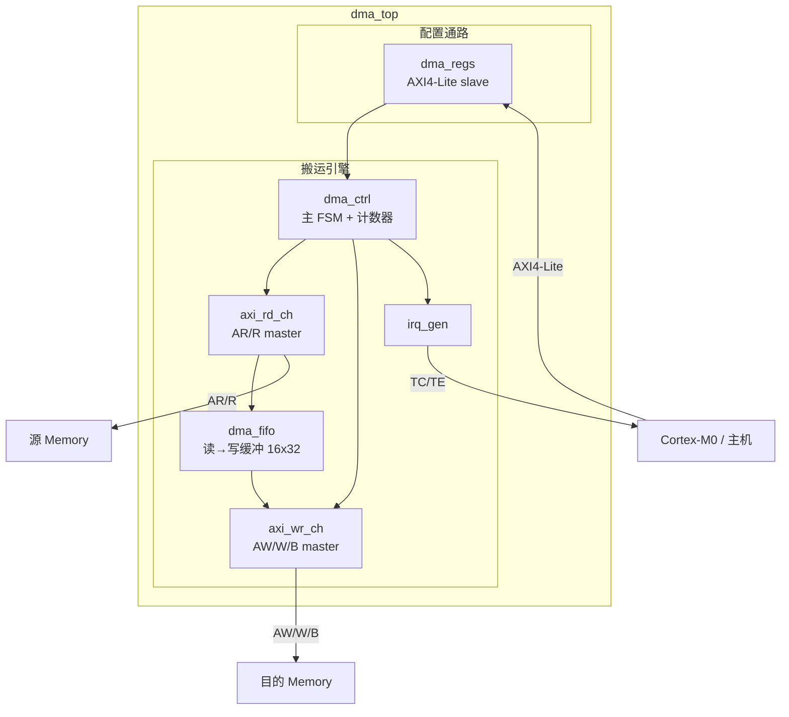
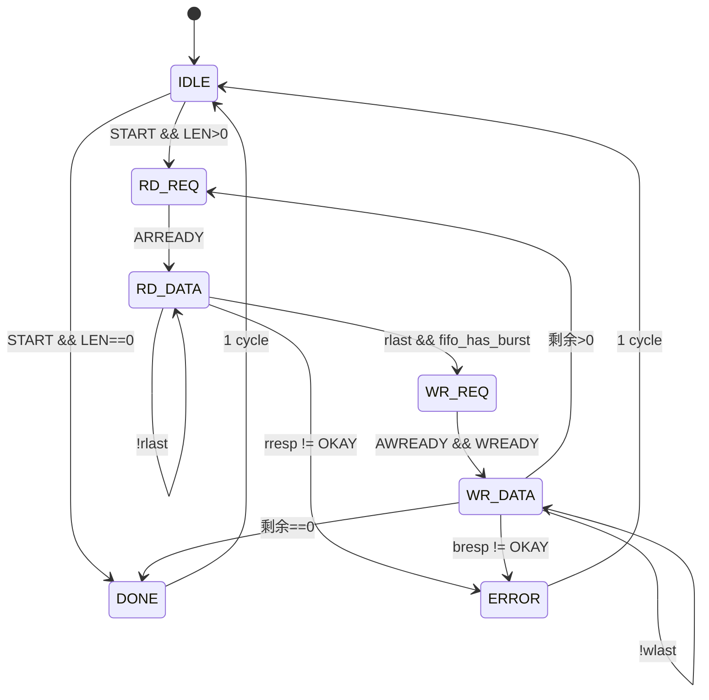

# Design Plan: dma_ctrl（单通道寄存器式 AXI DMA 控制器）

**Created:** 2026-08-21
**Planner:** GateFlow gf-plan
**Status:** Complete（P1~P5 全部实现并通过验证，2026-08-21；结果见 README.md）
**Target:** 独立学习项目（FPGA/仿真优先，可综合 RTL）

## 1. Overview

单通道、寄存器编程的 DMA 控制器：CPU 通过 **AXI4-Lite** 写入 SRC/DST/LEN/CTRL 触发传输，DMA 通过 **AXI4 读/写 master** 自主完成内存搬运，完成后产生 TC/TE 中断。本项目服务于两个目标：① 学习计划 v2 的 W4「AXI 五通道握手/burst/反压」与 A 级知识点「DMA 搬运与中断链路」；② 形成第二段可讲述的面试项目素材（AXI 协议 + FSM + SVA 闭环）。

**范围决策**（已与需求方确认）：

| 决策点 | 选择 | 说明 |
| --- | --- | --- |
| 总线 | AXI4-Lite（配置）+ AXI4（搬运） | 对齐 W4 与工业主流 |
| 编程模型 | 寄存器式（SA/DST/LEN/CTRL） | descriptor 链表留作二期扩展 |
| 通道数 | 1 | 多通道仲裁留扩展 |
| 数据宽度 | 32-bit（参数 `DATA_WIDTH`） | 地址 32-bit |
| Outstanding | 1 个 burst | 不做多 outstanding（简化时序） |
| 时钟域 | 单时钟域 `clk` | CDC 留扩展（见 §13） |

## 2. Requirements

**功能需求**
- FR1: CPU 写寄存器配置一次传输（SRC/DST/LEN/CTRL.START），DMA 完成 源→FIFO→目的 的搬运；
- FR2: 支持 AXI4 INCR burst，beat 数 1～16 可配（`CTRL.BURST`），尾部长度不足自动截断为短 burst；
- FR3: burst 不跨 **4KB 边界**（AXI4 规范），地址相位计算边界剩余空间并截断；
- FR4: 正确处理 slave 反压（READY 延迟），VALID 一旦拉高不撤回（AXI 死锁规避规则）；
- FR5: 错误响应（`BRESP/ARRESP = SLVERR/DECERR`）→ 停止传输、记录 ERRCODE、拉 TE 中断；
- FR6: TC（正常完成）/ TE（错误）中断，`ICR` 写 1 清除；
- FR7: `STATUS.BUSY` 期间新 START 被忽略；START 位写 1 后一拍自动回零。

**非功能需求**
- NPR1: 可综合（Xilinx 7 系 / 通用），无 latch、无组合环、复位覆盖 100%；
- NPR2: Verilator lint clean（`-Wall`）；
- NPR3: 自检 TB 全用例通过 + ≥6 条 SVA 无违反 + 功能覆盖率报告产出。

## 3. Block Diagram



数据流：`读通道 burst → FIFO → 写通道 burst`。FIFO 解耦两侧反压：读侧填、写侧排，FIFO 水位触发下一读 burst 请求（深度 16 = 最大 burst 长度，天然防溢出）。

## 4. Module Hierarchy

```text
dma_top                        # 顶层：例接线 + 参数传递
├── dma_regs                   # AXI4-Lite slave + 寄存器组 + W1C/自清逻辑
├── dma_ctrl                   # 主 FSM：burst 切分、4KB 边界、计数、错误处理
├── axi_rd_ch                  # AXI4 读 master（AR/R 通道 + ID 固定 0）
├── axi_wr_ch                  # AXI4 写 master（AW/W/B 通道，B 响应检查）
├── dma_fifo                   # 同步 FIFO 16x32（valid/ready 接口，参数化）
└── irq_gen                    # TC/TE 电平中断 + W1C
```

## 5. Interfaces

### 5.1 AXI4-Lite Slave（配置口）

| 信号 | 方向 | 宽度 | 说明 |
| --- | --- | ---: | --- |
| `s_axil_awaddr/awprot/awvalid` | in | 32/3/1 | 写地址通道 |
| `s_axil_awready` | out | 1 | 常 ready（单拍寄存器写） |
| `s_axil_wdata/wstrb/wvalid` | in | 32/4/1 | 写数据通道 |
| `s_axil_wready` | out | 1 | 与 awready 同拍 |
| `s_axil_bresp/bvalid` | out | 2/1 | 写响应，OKAY/SLVERR（非法偏移） |
| `s_axil_araddr/arvalid` | in | 32/1 | 读地址通道 |
| `s_axil_arready` | out | 1 | — |
| `s_axil_rdata/rresp/rvalid` | out | 32/2/1 | 读回 |

### 5.2 AXI4 Master（搬运口，仅必要信号）

| 信号 | 方向 | 说明 |
| --- | --- | --- |
| `m_axi_araddr/arlen/arsize/arburst/arvalid` | out | INCR，arsize=2（4B），arlen=beats-1 |
| `m_axi_arready` | in | — |
| `m_axi_rdata/rresp/rlast/rvalid` | in | 检查 rlast 与 rresp |
| `m_axi_awaddr/awlen/awsize/awburst/awvalid` | out | — |
| `m_axi_awready` | in | — |
| `m_axi_wdata/wlast/wstrb/wvalid` | out | wstrb=全 1 |
| `m_axi_wready` | in | — |
| `m_axi_bresp/bvalid` | in | 非 OKAY → TE |

### 5.3 其他

| 信号 | 方向 | 宽度 | 说明 |
| --- | --- | ---: | --- |
| `clk / rst_n` | in | 1 | 单时钟域；async assert sync deassert，低有效 |
| `irq_tc / irq_te` | out | 1 | 电平中断，ICR W1C |

## 6. Clock Domains & Reset

- 单时钟域，无 CDC（扩展方向见 §13）；
- 复位：异步复位、同步释放（`rst_sync` 2FF 释放同步器），所有时序逻辑带复位；
- 复位值：寄存器组清零、FSM→IDLE、FIFO 指针清零、中断拉低。

## 7. Register Map（AXI4-Lite，基址由 SoC 分配）

| 偏移 | 名称 | 访问 | 复位 | 说明 |
 | ---: | --- | --- | --- | --- |
| 0x00 | `SRC` | RW | 0x0 | 源起始地址（word 对齐） |
| 0x04 | `DST` | RW | 0x0 | 目的起始地址 |
| 0x08 | `LEN` | RW | 0x0 | 总传输 word 数（0 = 立即 TC） |
| 0x0C | `CTRL` | RW | 0x0 | 见位域 |
| 0x10 | `STATUS` | RO | 0x0 | 见位域 |
| 0x14 | `ICR` | WO(读 0) | — | 写 1 清 TC/TE |

**CTRL 位域**：`[0] EN`｜`[1] START`（W1 触发，硬件自清）｜`[4:2] BURST`（log2 beats：0=SINGLE…4=16）｜`[8] IE_TC`｜`[9] IE_TE`
**STATUS 位域**：`[0] BUSY`｜`[1] DONE`（TC 置位、START 清）｜`[5:4] ERRCODE`（0=无 1=SLVERR 2=DECERR 3=rresp 错）

## 8. FSM: dma_ctrl 主状态机

### 状态表

| 状态 | 编码 | 描述 |
| --- | --- | --- |
| IDLE | 3'b000 | 等 START；锁存 SRC/DST/LEN/BURST |
| RD_REQ | 3'b001 | 计算 burst beats（min(剩余, BURST, 4KB 边界余量)），发 ARVALID |
| RD_DATA | 3'b010 | 收 R beat 入 FIFO，数 rlast；rresp≠OKAY→ERROR |
| WR_REQ | 3'b011 | 发 AWVALID（beats=FIFO 中本批数量） |
| WR_DATA | 3'b100 | FIFO 出队发 W；bresp≠OKAY→ERROR |
| DONE | 3'b101 | 拉 irq_tc 一态、DONE 置位、回 IDLE |
| ERROR | 3'b110 | 记 ERRCODE、拉 irq_te、回 IDLE |

### 状态图



### 关键时序规则

- VALID 不依赖 READY（ARVALID/AWVALID/WVALID 拉高后保持到 READY，AXI 死锁规避）；
- 写通道 W 数据与 AW 并行发起（AW/W 同拍 valid 是合法且推荐的）；
- `beats = min(剩余 word 数, 2^BURST, (4096 − (addr & 0xFFF)) >> 2)`；
- BUSY 期间寄存器写被忽略（START 除外也忽略，软复位走全局 rst_n）。

## 9. Implementation Phases

| 阶段 | 内容 | 文件 | 验证关口 |
| --- | --- | --- | --- |
| P1 | `dma_pkg` + `dma_fifo` + `dma_regs` | rtl 3 文件 | 寄存器读写/自清/W1C 用例 + lint |
| P2 | 读通道单 beat 通路（SINGLE 搬 1 word） | `axi_rd_ch`、`dma_ctrl` 骨架 | 搬 1 word 内存 diff 通过 |
| P3 | 写通道 + burst + 4KB 截断 + FIFO 流控 | `axi_wr_ch`、ctrl 完善 | 随机长度/边界/反压用例 |
| P4 | 错误处理 + 中断 + 顶层集成 | `irq_gen`、`dma_top` | 全用例矩阵通过 |
| P5 | SVA bind + 覆盖率 + README | `dma_sva`、Makefile | SVA 0 违反 + 覆盖率报告 |

**Agent 分派**：P1-P4 RTL → `sv-codegen`；TB → `sv-testbench`；P5 SVA/覆盖率 → `sv-verification`；每阶段后 Verilator lint（rtl-agent 或 `/gf-lint`）。

## 10. File List

```text
22. dma_ctrl/
├── rtl/
│   ├── dma_pkg.sv          # 参数、结构体、ERRCODE 枚举
│   ├── dma_fifo.sv         # 同步 FIFO（valid/ready）
│   ├── dma_regs.sv         # AXI4-Lite slave + 寄存器组
│   ├── axi_rd_ch.sv        # AR/R master
│   ├── axi_wr_ch.sv        # AW/W/B master
│   ├── dma_ctrl.sv         # 主 FSM
│   └── dma_top.sv          # 顶层
├── tb/
│   ├── axi_lite_bfm.sv     # 配置 BFM（任务化 read/write reg）
│   ├── axi_mem_slave.sv    # 双口 AXI memory 模型（可插 wait/注错）
│   ├── tb_dma_top.sv       # 自检 TB + 用例调度
│   └── dma_sva.sv          # SVA（bind 到 dut）
├── scripts/
│   └── Makefile            # iverilog/Verilator 双目标 + 回归
└── .gateflow/plans/dma_ctrl.md  # 本文档
```

## 11. Verification Strategy

**自检 TB 架构**：`axi_lite_bfm`（配置流）+ DUT + 2×`axi_mem_slave`（源/目的，可配置 wait-state 概率与错误注入地址）+ scoreboard（传输完成后 `dst_mem[src_region]` 快照 diff）+ `[FINISH] PASS/FAIL` 终态打印。

**用例矩阵**：

| 类别 | 用例 | 期望 |
| --- | --- | --- |
| 功能 | SINGLE 1 word / 16-beat 满 burst / 非 2 幂总长（尾截断） | 数据 diff = 0，DONE=1 |
| 边界 | 跨 4KB 地址（burst 分裂）/ LEN=0 / 非对齐地址（SLVERR） | 分裂搬运正确 / 立即 TC / ERRCODE |
| 反压 | 源/目的随机 wait state（p=0.3/0.5） | 结果一致，无死锁（超时看门狗） |
| 错误 | 注入 SLVERR（读侧/写侧） | 停机、ERRCODE 正确、TE 中断 |
| 中断 | TC/TE 触发与 ICR 清除、IE 关闭时无中断 | 电平行为正确 |
| 并发 | BUSY 中重复写 START/改写 LEN | 被忽略，传输不受扰 |

**SVA 清单**（≥6，P5 由 sv-verification 细化）：

| # | Property | 类型 |
| --- | --- | --- |
| 1 | ARVALID/AWVALID/WVALID 一旦拉高保持到对应 READY | 协议（死锁规避） |
| 2 | RLAST 仅在 burst 末拍出现且 beat 计数匹配 | 协议 |
| 3 | `STATUS.BUSY=1` 期间 START 被忽略（无新 burst） | 功能 |
| 4 | START 写 1 后最多 2 拍自清 | 功能 |
| 5 | DONE 置位蕴含已搬运 word 数 == 编程 LEN | 安全 |
| 6 | FIFO 永不 overflow/underflow | 安全 |
| 7 | 错误态 1 拍内停发新 AR/AW | 安全 |

**覆盖率**：burst 长度 bins(1,2,4,8,16) × 尾部类型 cross；wait-state 密度 bins；错误类型 bins；中断开关 × 事件 cross。目标 line/branch ≥90%、FSM 状态 100%。

## 12. Area / Timing 预估（FPGA 量级）

| 模块 | LUT | FF | 备注 |
| --- | ---: | ---: | --- |
| dma_regs（AXI4-Lite） | ~250 | ~350 | 含寄存器组 |
| axi_rd_ch + axi_wr_ch | ~200 | ~150 | — |
| dma_ctrl | ~150 | ~120 | FSM+计数器 |
| dma_fifo 16x32 | ~40 | ~100 | BRAM 可选，此深度 LUTRAM 合适 |
| **合计** | **~650** | **~750** | XC7Z020 占用 <1%，无时序风险 |

## 13. 二期扩展（不在本期实现，面试口头储备）

多通道 + 轮询仲裁 → descriptor 链表（NEXT_PTR/scatter-gather）→ 读写并行双 engine（吞吐×2）→ CDC 版（AXI 时钟域→功能时钟域 async FIFO）。

## Approval

- [ ] 架构评审通过
- [ ] 接口/寄存器确认
- [ ] 批准进入实现（/gf 执行 P1）

---
*Generated by GateFlow Planner · 2026-08-21*
