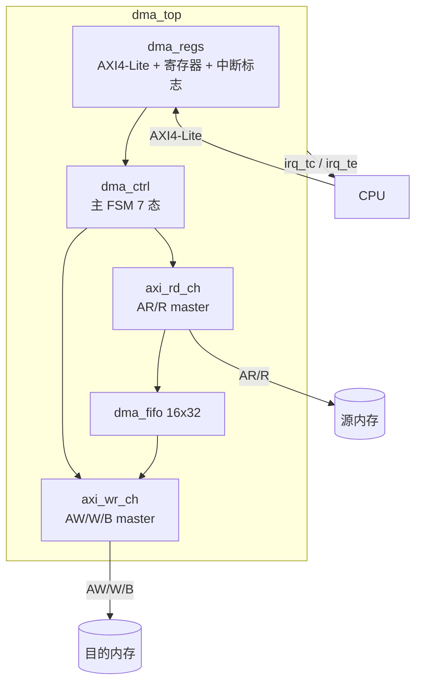

# dma_ctrl —— 单通道寄存器式 AXI DMA 控制器

> 学习项目（学习计划 v2 的 AXI/DMA 实践件）：CPU 经 AXI4-Lite 配置一次寄存器，
> DMA 经 AXI4 读写通道自主搬运内存，完成/错误后产生中断。
> 设计文档见 `.gateflow/plans/dma_ctrl.md`（GateFlow gf-plan 产出）。

## 1. 规格摘要

| 项 | 值 |
| --- | --- |
| 编程模型 | 寄存器式（SRC/DST/LEN/CTRL 直写触发），单通道 |
| 配置总线 | AXI4-Lite slave（简化：B/R 响应无 ready，单拍脉冲） |
| 搬运总线 | AXI4 master：读 AR/R + 写 AW/W/B，1 outstanding |
| Burst | INCR，1~16 beats 可配（CTRL.BURST），尾部/剩余自动降级 |
| 边界 | burst 不跨 4KB（AXI4 规范），地址相位计算余量截断 |
| 数据宽度 | 32-bit 数据 / 32-bit 地址 |
| 缓冲 | 16×32 同步 FIFO 解耦读写反压 |
| 中断 | TC（完成）/ TE（错误），电平，ICR 写 1 清除，IE 独立门控 |
| 错误处理 | RRESP/BRESP 非 OKAY → 停发、ERRCODE 锁存、TE 中断 |
| 时钟/复位 | 单时钟域；`rst_n` 低有效异步复位 |
| 规模 | ~650 LUT / ~750 FF（XC7Z020 <1%，估算） |

## 2. 架构



主 FSM（7 态）：`IDLE → RD_REQ → RD_DATA → WR_REQ → WR_DATA →(剩余>0 回 RD_REQ / ==0) DONE / ERROR`。
burst 切分：`beats = min(剩余, 2^BURST, 4KB边界余量)`，读写双游标独立推进。

## 3. 文件结构

```text
22. dma_ctrl/
├── rtl/
│   ├── dma_pkg.sv      # 共享包：ERRCODE / 寄存器偏移 / 位域 / 响应码
│   ├── dma_fifo.sv     # 参数化同步 FIFO（valid/ready，水位寄存输出）
│   ├── dma_regs.sv     # AXI4-Lite slave + 6 寄存器 + 中断标志
│   ├── axi_rd_ch.sv    # 读 master：AR 握手 / R 逐 beat 检查（RRESP/RLAST）
│   ├── axi_wr_ch.sv    # 写 master：AW/W 并行推 / B 响应检查
│   ├── dma_ctrl.sv     # 主 FSM：burst 切分 / 游标 / 错误处理
│   └── dma_top.sv      # 顶层封装（45 端口）
├── tb/
│   ├── axi_lite_bfm.sv # 配置 BFM（axil_write/read 任务 + 超时保护）
│   ├── axi_mem_slave.sv# AXI memory 模型：读+写、三处反压、双侧注错
│   ├── dma_sva.sv      # 8 条属性检查（程序化 checker，见 §6）
│   ├── tb_dma_regs.sv  # P1：寄存器组 6 用例 37 检查项
│   └── tb_dma_full.sv  # 顶层端到端 9 用例 45 检查项
├── scripts/
│   ├── run.sh          # 一键回归（bash）
│   └── Makefile        # 等价 make 目标
└── .gateflow/plans/dma_ctrl.md   # 设计文档（gf-plan 产出）
```

## 4. 寄存器映射

| 偏移 | 名称 | 访问 | 说明 |
| ---: | --- | --- | --- |
| 0x00 | SRC | RW | 源起始地址（word 对齐） |
| 0x04 | DST | RW | 目的起始地址 |
| 0x08 | LEN | RW | 总传输 word 数（0 = 立即 DONE） |
| 0x0C | CTRL | RW | [0]EN [1]START(W1 自清) [4:2]BURST(log2 beats) [8]IE_TC [9]IE_TE |
| 0x10 | STATUS | RO | [0]BUSY [1]DONE [5:4]ERRCODE（0 无/1 SLV/2 DEC/3 RRESP） |
| 0x14 | ICR | WO | [0]清 TC [1]清 TE（写 1 清除，读回 0） |

## 5. 快速开始

```bash
# Windows Git Bash / Linux / WSL（需 iverilog）
bash scripts/run.sh

# 或手动
iverilog -g2012 -s tb_dma_full -o sim.vdp rtl/*.sv tb/*.sv   # 通配顺序按字母，如报错按 run.sh 显式顺序
vvp sim.vdp
```

期望输出：`[FINISH] PASS` × 2 + `[SVA] PASS`。

## 6. 验证结果（2026-08-21，iverilog -g2012）

| TB | 规模 | 结果 |
| --- | --- | --- |
| tb_dma_regs（P1） | 6 用例 37 检查项 | 37/37 PASS |
| tb_dma_full（P2~P4） | 9 用例 45 检查项 | 45/45 PASS |
| dma_sva（P5） | 8 条属性 | 0 违反 |

### 用例-特性覆盖矩阵（功能覆盖证据）

| 特性 | 覆盖用例 |
| --- | --- |
| SINGLE 传输 / 数据完整性 | U1、U8（mem diff 比对） |
| 满 burst（16 beat） | U2 |
| burst 切分与尾部降级（16+16+5） | U3 |
| 4KB 边界截断（2+6 分裂） | U4 |
| 读地址/写地址/写数据三处反压 | U5 |
| BUSY 窗口与写保护 | U5（读 BUSY、写 SRC 被忽略） |
| 写侧 SLVERR → ERROR/TE | U6 |
| 读侧 SLVERR → ERROR/TE | U9 |
| LEN=0 立即完成 | U7 |
| ARVALID 死锁规避 | U8（monitor_ar_hold 逐拍监视） |
| START 自清 / ICR W1C / IE 门控 | P1 TB T3/T4 + U6/U9 |
| 中断链路（TC/TE 置位-清除） | P1 TB + U6/U9 |

### 属性检查清单（dma_sva.sv，程序化 checker）

| # | 属性 | 等价 SVA |
| --- | --- | --- |
| 1-3 | AR/AW/W VALID 保持到 READY | `(v && !r) \|=> v` |
| 4 | START 脉冲单拍 | `pulse \|=> !pulse` |
| 5 | BUSY 期间无新 START | `busy \|-> !pulse` |
| 6 | 完成时搬运数 == LEN | `tc_event \|-> wbeat_cnt == len` |
| 7 | 错误次拍通道静默 | `te \|=> !(arv\|\|awv\|\|wv)` |
| 8 | WVALID 时 FIFO 非空 | `wv \|-> cnt != 0` |

## 7. 设计决策记录

1. **ICR 位域**（规格留白）：`ICR[0]`=清 TC、`ICR[1]`=清 TE；
2. **BUSY 期间写静默 OKAY**：握手照常、寄存器不更新——ARM DMA 惯例，软件无感知；另一流派回 SLVERR 提示；
3. **irq 不单设模块**：中断标志/门控并入 dma_regs（避免空壳模块）；
4. **错误 beat 数据照入 FIFO**：AR 已发出必须收完 burst，错误统一由 done/err 上报；TB 侧以用例排序（U9 置末）消化残留；
5. **读-写串行交替**：FIFO 解耦反压但不做读写并行（吞吐×2 留二期）。

## 8. 工具链与已知局限

- **iverilog `Case unique ... ignored`**：vvp 后端忽略 unique 修饰符的提示，非错误；
- **SVA 以程序化 checker 实现**：iverilog 对命名并发断言 / `disable iff` / action block 支持不完整；属性语义与标准 SVA 一一对应（模块内注释给出对照），VCS/Verdi 下可平替；
- **无 covergroup/bins 收集**：功能覆盖证据 = 检查项 + 属性零违反 + §6 覆盖矩阵（iverilog 限制的诚实替代，非数值覆盖率）；
- 仿真产物（`sim_tmp/`）不入库。

## 9. 开发过程与调试实录（面试素材）

- Phase 1→4 增量验证：先 SINGLE 后 burst、读写通道分阶段接入，每阶段独立验证关口；
- 抓到并修复的代表性问题：
  - `calc_beats_m1` off-by-one（注释写 -1、代码漏减）→ SINGLE 发成 2 beat、FIFO 多进一个数据——由 TB 的 `fifo_cnt==2` 现象定位；
  - TB 竞态两类：检查早于事件（`wait_xfer_end` 提前退出）与写后即查（BFM 返回拍=提交沿，标志 3 拍后才可见）；
  - P2 TB 因 P3 FSM 架构演进退役（RD_DATA 必经 WR 态），检查项迁移保全；
- 工具链适配：SVA→checker 降级、FIFO 排空→用例排序、多驱动→门控或门方案。

## 10. 二期扩展（不在本期）

多通道轮询仲裁 → descriptor 链表（scatter-gather）→ 读写并行双 engine → CDC 版本（async FIFO 跨时钟域）。

---
*Phase 1~5 全部完成 · 2026-08-21 · GateFlow gf-plan 规划 + 人工/代理混合实现 · iverilog 回归全绿*
